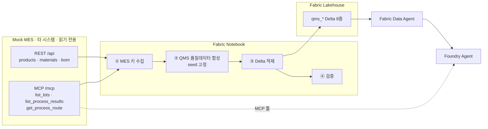

# QMS Lakehouse 가상 데이터 설계

작성일: 2026-09-04
상태: 승인됨

## 1. 목적

Mock MES(반도체 팹 생산 시스템)와 **비즈니스 키로만 연동되는** 가상 QMS(품질관리 시스템)
데이터를 Microsoft Fabric 레이크하우스에 생성한다. 생성된 테이블은 Fabric Data Agent의
데이터 원본이 되고, 그 Data Agent는 Foundry 에이전트에 연결된다.

최종 그림에서 두 시스템은 서로 다른 솔루션으로 남는다.

- **MES**: 별도 시스템. Foundry 에이전트에 MCP 툴로 연결된다.
- **QMS**: Fabric 레이크하우스에 데이터가 존재한다. Data Agent로 노출된다.

에이전트는 두 채널을 함께 호출해 하나의 질문에 답한다.

## 2. 설계 원칙

### 2.1 무중복 원칙

두 시스템은 DB 수준의 FK 제약을 갖지 않는다. 대신 **비즈니스 키로 조회가 성립**해야 하고,
**같은 사실을 양쪽이 중복 보유해서는 안 된다.**

현장 관점의 근거는 단순하다. LOT0011이 CMP 공정에서 작업하다 품질검사를 받았을 때,
MES 스키마에는 검사 기준·측정치·부적합 조사·MRB 처리 결정이 남지 않는다. 그것들은 QMS의 사실이다.

| MES가 보유한 사실 | QMS 보유 여부 | QMS가 대신 갖는 사실 |
|---|---|---|
| `lot_id`, `product_code`, `step_code`, `material_code` | 키로만 참조 | — |
| `defect_code` (6종 문자열) | 키로만 참조 | 코드의 의미: 카테고리·심각도·표준원인 |
| `result` (Pass/Fail/Rework) | 미보유 | 품질부서 독립 판정과 판정 근거 |
| `scrap_qty` (집계 수량) | 미보유 | 웨이퍼/샘플 단위 검출 상세 |
| `operator` (생산 작업자) | 미보유 | 검사원(별도 인력·자격 체계) |
| `eqp_id`, `in_time`, `out_time` | 키로만 참조 | 계측설비, 검사 일시 |
| `in_qty`, `out_qty` | 미보유 | 샘플 크기, 영향 수량 |

QMS 테이블에 `mes_result`, `scrap_qty`, `operator`, `in_qty`, `out_qty` 컬럼이 존재하면
설계 위반이며, 검증 셀이 이를 자동 검출한다.

### 2.2 Data Agent 최적화 정규화

테이블 구성은 정규화를 따르되, 두 가지를 의도적으로 추가한다.

**조인키 하향 전개**: 모든 트랜잭션 테이블이 `lot_id`, `product_code`, `step_code`를 직접
보유한다. Data Agent가 "LOT0011 처리내역"을 물으면 `qms_disposition` 단독 조회로 답한다.
조인 깊이가 4~5단에서 1~2단으로 줄어 NL2SQL 정확도가 올라간다.

**한글 라벨 병기**: 코드 컬럼마다 한글 설명 컬럼을 둔다(`defect_name_ko`, `step_name`,
`product_name`, `material_name`). "포토 공정 불량"이라는 자연어를 `step_code='PHOTO'`로
매핑하는 데 필요하다. MES 라벨과 일부 중복되지만 NL2SQL 정확도를 우선한다.

## 3. MES 실측 데이터 (2026-09-04 기준)

노트북이 참조할 MES의 실제 상태다. 모든 값은 REST API와 MCP로 확인했다.

### 3.1 접근 채널

| 채널 | 엔드포인트 | 인증 | 제공 데이터 |
|---|---|---|---|
| REST | `https://mock-mes.greenrock-bb44c93a.koreacentral.azurecontainerapps.io/api` | `X-API-Key` 헤더 | products(4), materials(12), bom(48), product-inventory(7), product-results(10) |
| MCP | 같은 호스트 `/mcp` (streamable HTTP) | 같은 `X-API-Key` 헤더 | `list_lots`(16), `list_process_results`(91), `get_process_route`(9), `get_wip`, `get_lot` |

로트 이력과 공정 이력은 REST에 없고 **MCP에만 있다.** 따라서 노트북은 두 채널을 모두 쓴다.

MCP는 `mcp` 파이썬 패키지 없이 `urllib` 표준 라이브러리로 JSON-RPC를 직접 구현한다.
`initialize` → `notifications/initialized` → `tools/call` 순서이며, 응답은 JSON 또는
SSE(`data:` 접두) 두 형태 모두 처리한다. 세션 헤더는 이 서버에서 요구하지 않는다.

MCP 쓰기 툴(`start_lot`, `register_process_result`)은 **호출하지 않는다.** 노트북은 MES에
대해 읽기 전용이다.

### 3.2 마스터 값

**제품 4종**

| product_code | product_name | tech_node |
|---|---|---|
| DDR5 | DDR5-16G | 10nm |
| LX9 | LX9 AP | 5nm |
| NAND | V7 NAND | 128L |
| PMIC | PMIC-33 | 28nm |

**공정 라우트 9단계**

| seq | step_code | step_name | operation | eqp_type | stage |
|---|---|---|---|---|---|
| 10 | DIFF | Diffusion | Thermal Oxidation | Furnace | FAB |
| 20 | PHOTO | Photolithography | Pattern Exposure | Scanner | FAB |
| 30 | ETCH | Etch | Plasma Etch | Etcher | FAB |
| 40 | IMPL | Ion Implant | Dopant Implant | Implanter | FAB |
| 50 | CVD | Deposition (CVD) | Thin-Film Deposition | CVD | FAB |
| 60 | CMP | Planarization (CMP) | Chemical-Mechanical Polish | Polisher | FAB |
| 70 | METRO | Metrology | Inline Inspection | Metrology | FAB |
| 80 | TEST | Wafer Test (EDS) | Electrical Die Sort | Prober | FAB |
| 90 | PKG | Packaging | Assembly & Test | Bonder | PACK |

**설비 9대**: EQP-CMP01(Polisher-A), EQP-CVD01(CVD-A), EQP-DIFF01(Furnace-A),
EQP-ETCH01(Etcher-A), EQP-IMPL01(Implanter-A), EQP-PHOT01(Scanner-EUV1),
EQP-PHOT02(Scanner-DUV1), EQP-PKG01(Bonder-A), EQP-TEST01(Prober-A)

**자재 12종**

| material_code | material_name | category | uom | location |
|---|---|---|---|---|
| RAW-WAFER-300 | 300mm Blank Silicon Wafer | Raw Wafer | EA | WH-RAW |
| PR-EUV | EUV Photoresist | Chemical | L | WH-CHEM |
| SLURRY-CMP | CMP Slurry | Chemical | L | WH-CHEM |
| DOPANT-B | Boron Dopant Source | Chemical | L | WH-CHEM |
| GAS-AR | Argon (Ar) Gas | Gas | BTL | WH-GAS |
| GAS-SIH4 | Silane (SiH4) Gas | Gas | BTL | WH-GAS |
| TARGET-CU | Copper Sputter Target | Metal | EA | WH-MAT |
| RETICLE-5NM | EUV Reticle Set (5nm) | Mask | SET | WH-MASK |
| BOND-WIRE | Gold Bond Wire | Package | M | WH-PKG |
| MOLD-EMC | Epoxy Mold Compound | Package | KG | WH-PKG |
| SOLDER-BALL | SnAg Solder Ball | Package | EA | WH-PKG |
| SUBSTRATE | BGA Package Substrate | Package | EA | WH-PKG |

**로트 16건**: LOT0001~LOT0016. 상태 분포 Running 8 / Done 6 / Hold 2,
우선순위 Normal 9 / Low 5 / Hot 2. 4개 제품에 순환 배정됨.

**공정 이력 91건**: 판정 Pass 84 / Fail 5 / Rework 2.
불량코드 분포 — 없음 56, Particle 8, Scratch 8, Overlay 7, Etch-Residue 5,
Contamination 5, CD-OOS 2. 작업자 5명(kim.js, lee.mh, park.sy, choi.dw, jung.hy).

Fail/Rework 7건의 실제 위치:

| id | lot_id | step_code | result | defect_code |
|---|---|---|---|---|
| 77 | LOT0013 | DIFF | Fail | (없음) |
| 74 | LOT0012 | CVD | Fail | (없음) |
| 69 | LOT0011 | CMP | Fail | CD-OOS |
| 64 | LOT0011 | DIFF | Rework | (없음) |
| 63 | LOT0010 | ETCH | Rework | Particle |
| 35 | LOT0005 | ETCH | Fail | (없음) |
| 27 | LOT0004 | ETCH | Fail | (없음) |

**BOM 48행**: 4제품 × 7단계 조합. METRO와 TEST에는 BOM이 없다.

## 4. 아키텍처



## 5. 데이터 모델

### 5.1 엔터티 관계

```mermaid
erDiagram
  MES_PROCESS["MES · lot / process_result"] ||..o{ QMS_INSPECTION : "lot_id + step_code"
  MES_MATERIAL["MES · material"] ||..o{ QMS_IQC : "material_code"

  QMS_SPEC["qms_inspection_spec"] ||--o{ QMS_MEASUREMENT : spec_id
  QMS_INSPECTOR["qms_inspector"] ||--o{ QMS_INSPECTION : inspector_id
  QMS_DEFECT["qms_defect_code"] ||--o{ QMS_NCR : defect_code
  QMS_INSPECTION["qms_inspection"] ||--o{ QMS_MEASUREMENT : inspection_id
  QMS_INSPECTION ||--o{ QMS_NCR : inspection_id
  QMS_IQC["qms_incoming_inspection"] ||--o{ QMS_NCR : iqc_id
  QMS_NCR ||--o{ QMS_DISPOSITION : ncr_id
  QMS_MEASUREMENT["qms_measurement"]
  QMS_DISPOSITION["qms_disposition"]
```

점선은 시스템 간 소프트 조인이다. FK 제약이 없고 양쪽에 복제본도 없다.

### 5.2 행수 배분

| 테이블 | 구분 | 행수 | 산출 근거 |
|---|---|---|---|
| `qms_defect_code` | 마스터 | 24 | MES 6종 × 세부 4종 전개 |
| `qms_inspection_spec` | 마스터 | 108 | 4제품 × 9공정 × 3특성 |
| `qms_inspector` | 마스터 | 15 | 5팀 × 3교대 |
| `qms_inspection` | 트랜잭션 | 210 | IPQC 91(MES 앵커) + OQC 119 |
| `qms_measurement` | 트랜잭션 | 약 260 | 계량형 검사 약 87건 × 포인트 2~4 |
| `qms_incoming_inspection` | 트랜잭션 | 200 | 자재 12종 × 입고 회차 |
| `qms_nonconformance` | 트랜잭션 | 95 | 6.4 출처 배분 참조 |
| `qms_disposition` | 트랜잭션 | 95 | NCR 1:1 |

합계 약 1,007행. 마스터계를 200으로 맞추면 비현실적이고, 부적합을 200으로 맞추면
검사 대비 부적합률이 50%가 되어 팹 현실과 어긋나므로 자연 크기를 택했다.

**측정치 저장 범위에 대한 결정**: 실제 SPC는 샘플링 계획의 모든 원시 포인트를 저장한다.
`sampling_method`가 "5매 랜덤 9포인트"면 검사 1건당 45행이 된다. 이 데모에서는 검사 1건당
**대표 포인트 2~4점만 저장**한다. 규격 이탈이 발생한 검사는 이탈 포인트를 반드시 포함시켜
`is_out_of_spec` 분석이 성립하게 한다. `sampling_method`는 원 계획을 그대로 기술하고,
`qms_inspection.measurement_count`에 실제 저장 행수를 기록해 둘의 차이를 명시한다.
목표는 250~270행이며, 검증 셀은 이 범위를 허용한다.

### 5.3 테이블 스키마

기호: `MES` = MES와 조인되는 소프트 키, `FK` = QMS 내부 참조

#### qms_defect_code (마스터, 24행)

| 컬럼 | 타입 | 설명 |
|---|---|---|
| `defect_code` | string PK | QMS 세부 불량코드. 예 `DEF-PTC-001` |
| `defect_name_ko` | string | 한글 불량명. 예 "파티클 오염 0.12um 이상" |
| `defect_name_en` | string | 영문 불량명 |
| `mes_defect_code` | string `MES` | MES 상위 코드. Particle/Scratch/Overlay/Etch-Residue/Contamination/CD-OOS |
| `defect_category` | string | 오염/패턴/치수/막질/전기/외관 |
| `severity` | string | Critical/Major/Minor |
| `severity_score` | int | 9/6/3 |
| `typical_step_codes` | string `MES` | 주 발생 공정 CSV. 예 `DIFF,CVD` |
| `standard_cause_ko` | string | 표준 원인 |
| `standard_action_ko` | string | 표준 조치 |
| `is_active` | boolean | 사용 여부 |

#### qms_inspection_spec (마스터, 108행)

| 컬럼 | 타입 | 설명 |
|---|---|---|
| `spec_id` | string PK | 예 `SPEC-DDR5-PHOTO-CD` |
| `product_code` | string `MES` | 제품 코드 |
| `product_name` | string | 제품명 라벨 |
| `step_code` | string `MES` | 공정 코드 |
| `step_name` | string | 공정명 라벨 |
| `characteristic_code` | string | CD/OVL/THK/PTC/RS/WRP |
| `characteristic_name_ko` | string | 선폭/정렬도/막두께/파티클수/면저항/휨 |
| `measurement_type` | string | 계량형/계수형 |
| `unit` | string | nm/um/ea/Ω·sq/% |
| `target_value` | double | 목표치 |
| `lsl` | double | 하한 규격 |
| `usl` | double | 상한 규격 |
| `cpk_target` | double | 1.33 |
| `sampling_method` | string | 예 "5매 랜덤 9포인트" |
| `sample_size` | int | 샘플 매수 |
| `inspection_frequency` | string | 전수/로트별/시간별 |
| `control_method_ko` | string | 예 "X-bar R 관리도" |
| `spec_version` | string | 개정 버전 |
| `effective_from` | date | 적용 시작일 |
| `is_active` | boolean | 사용 여부 |

#### qms_inspector (마스터, 15행)

| 컬럼 | 타입 | 설명 |
|---|---|---|
| `inspector_id` | string PK | 예 `QI-001` |
| `inspector_name` | string | 검사원명. MES `operator`와 겹치지 않는 별도 인력 |
| `team_ko` | string | 계측팀/입고검사팀/신뢰성팀/출하검사팀/품질보증팀 |
| `shift_code` | string | A/B/C |
| `qualification_level` | string | 초급/중급/선임/책임 |
| `certified_characteristics` | string | 자격 보유 특성 CSV |
| `certified_from` | date | 자격 취득일 |
| `certified_until` | date | 자격 만료일 |
| `is_active` | boolean | 재직 여부 |

#### qms_inspection (트랜잭션, 210행)

| 컬럼 | 타입 | 설명 |
|---|---|---|
| `inspection_id` | string PK | 예 `INS-2026-0001` |
| `inspection_type` | string | IPQC(공정검사)/OQC(출하검사) |
| `lot_id` | string `MES` | 로트 |
| `product_code` | string `MES` | 제품 |
| `product_name` | string | 제품명 라벨 |
| `step_code` | string `MES` | 공정 |
| `step_name` | string | 공정명 라벨 |
| `eqp_id` | string `MES` | 생산설비 |
| `mes_process_result_id` | int `MES` | MES 공정이력 1건과 직접 연결 |
| `inspector_id` | string `FK` | 검사원 |
| `inspection_datetime` | timestamp | 검사 일시 |
| `sample_size` | int | 검사 샘플 수 |
| `inspected_wafer_qty` | int | 검사 웨이퍼 수 |
| `judgment` | string | 합격/조건부합격/불합격. MES `result`와 독립 |
| `judgment_basis_ko` | string | 판정 근거 |
| `defect_found_qty` | int | 검출 결함 수 |
| `measurement_count` | int | 측정 건수 |
| `has_nonconformance` | boolean | NCR 발행 여부 |
| `remark_ko` | string | 비고 |

#### qms_measurement (트랜잭션, 260행)

| 컬럼 | 타입 | 설명 |
|---|---|---|
| `measurement_id` | string PK | 예 `MEA-2026-000001` |
| `inspection_id` | string `FK` | 검사 |
| `spec_id` | string `FK` | 검사기준 |
| `lot_id` | string `MES` | 하향 전개 조인키 |
| `product_code` | string `MES` | 하향 전개 조인키 |
| `step_code` | string `MES` | 하향 전개 조인키 |
| `characteristic_code` | string | 측정 특성 |
| `characteristic_name_ko` | string | 특성명 라벨 |
| `sample_no` | int | 웨이퍼 번호 |
| `site_no` | int | 측정 포인트 |
| `measured_value` | double | 측정값 |
| `unit` | string | 단위 |
| `target_value` | double | 규격 스냅샷. spec 개정 대비 |
| `lsl` | double | 규격 스냅샷 |
| `usl` | double | 규격 스냅샷 |
| `deviation_pct` | double | 목표 대비 편차율 |
| `is_out_of_spec` | boolean | 규격 이탈 여부 |
| `judgment` | string | OK/NG |
| `metrology_eqp_id` | string | QMS 계측기. 예 `MET-CD01`. MES 생산설비와 별개 |
| `measured_by` | string `FK` | 검사원 |
| `measured_at` | timestamp | 측정 시각 |

#### qms_incoming_inspection (트랜잭션, 200행)

| 컬럼 | 타입 | 설명 |
|---|---|---|
| `iqc_id` | string PK | 예 `IQC-2026-0001` |
| `material_code` | string `MES` | 자재 |
| `material_name` | string | 자재명 라벨 |
| `supplier_code` | string | 공급업체 코드. QMS 고유 |
| `supplier_name_ko` | string | 공급업체명 |
| `supplier_lot_no` | string | 공급업체 로트번호 |
| `receipt_date` | date | 입고일 |
| `received_qty` | double | 입고 수량 |
| `uom` | string | 단위 |
| `sample_size` | int | 샘플 수 |
| `inspection_items_ko` | string | 검사 항목. 예 "순도/입도/외관" |
| `judgment` | string | 합격/불합격/특채 |
| `defect_code` | string `FK` | 불합격 시 불량코드 |
| `coa_received` | boolean | 성적서 수령 여부 |
| `coa_conformance` | string | 일치/불일치/미제출 |
| `inspector_id` | string `FK` | 검사원 |
| `inspection_date` | date | 검사일 |
| `remark_ko` | string | 비고 |

#### qms_nonconformance (트랜잭션, 95행)

| 컬럼 | 타입 | 설명 |
|---|---|---|
| `ncr_id` | string PK | 예 `NCR-2026-0001` |
| `ncr_source` | string | 공정검사/입고검사/출하검사/고객제기 |
| `inspection_id` | string `FK` | 검사 출처일 때 |
| `iqc_id` | string `FK` | 입고검사 출처일 때 |
| `lot_id` | string `MES` | 로트. 해당 시 |
| `product_code` | string `MES` | 제품. 해당 시 |
| `product_name` | string | 제품명 라벨 |
| `step_code` | string `MES` | 공정. 해당 시 |
| `step_name` | string | 공정명 라벨 |
| `material_code` | string `MES` | 자재. 해당 시 |
| `eqp_id` | string `MES` | 설비. 해당 시 |
| `defect_code` | string `FK` | QMS 세부 불량코드 |
| `mes_defect_code` | string `MES` | MES 상위 불량코드. 양방향 조회용 |
| `severity` | string | Critical/Major/Minor |
| `affected_qty` | int | 영향 수량 |
| `detected_date` | date | 검출일 |
| `root_cause_category` | string | 설비/자재/작업방법/환경/측정 |
| `root_cause_ko` | string | 5-why 요약 |
| `immediate_action_ko` | string | 즉시 조치 |
| `owner_dept_ko` | string | 담당 부서 |
| `owner_name` | string | 담당자 |
| `status` | string | 접수/조사중/처리대기/완료/보류 |
| `due_date` | date | 완료 기한 |
| `closed_date` | date | 종결일 |
| `estimated_cost_krw` | long | 추정 손실액 |

#### qms_disposition (트랜잭션, 95행)

| 컬럼 | 타입 | 설명 |
|---|---|---|
| `disposition_id` | string PK | 예 `DSP-2026-0001` |
| `ncr_id` | string `FK` | 부적합 |
| `lot_id` | string `MES` | 하향 전개 조인키 |
| `product_code` | string `MES` | 하향 전개 조인키 |
| `step_code` | string `MES` | 하향 전개 조인키 |
| `disposition_type` | string | 재작업/폐기/특채/반품/선별 |
| `disposition_qty` | int | 처리 수량 |
| `decision_date` | date | 결정일 |
| `decision_body_ko` | string | MRB/품질책임자/생산책임자 |
| `approver_name` | string | 승인자 |
| `approval_status` | string | 승인/반려/대기 |
| `rework_step_code` | string `MES` | 재작업 복귀 공정 |
| `rework_result` | string | 성공/실패/진행중 |
| `scrap_cost_krw` | long | 폐기 비용 |
| `effectiveness_check_date` | date | 유효성 확인일 |
| `effectiveness_result` | string | 유효/재발/확인중 |
| `reason_ko` | string | 처리 사유 |

## 6. 데이터 생성 로직

난수로 생성하면 "MES는 Pass인데 QMS는 폐기"같은 모순이 발생한다. 그래서 MES 91건 이력을
생성 앵커로 사용한다.

### 6.1 검사 발생 규칙

MES 공정이력의 상태가 QMS 검사 판정을 결정한다.

| MES 상태 | 건수 | QMS 판정 규칙 |
|---|---|---|
| `result=Fail` | 5 | 반드시 불합격 → NCR 생성 |
| `result=Rework` | 2 | 조건부합격 또는 불합격 → NCR 생성 |
| `Pass` + `defect_code` 있음 | 33 | 합격 70% / 조건부합격 30% |
| `Pass` + 결함 없음 | 51 | 합격 94% / 불합격 6% (품질홀드) |

여기에 OQC(출하검사)를 추가한다. `status=Done`인 로트 6건에 대해 제품 특성별로 검사를
생성해 총 210행을 맞춘다.

### 6.2 의도적 불일치 장치 (13건)

두 시스템을 함께 조회해야만 답이 나오는 상황을 의도적으로 심는다. Foundry 에이전트
데모의 핵심 시나리오다.

| # | 장치 | 건수 | 구현 | 대표 질문 |
|---|---|---|---|---|
| 1 | MES Pass ↔ QMS 불합격(품질홀드) | 3 | `Pass`+결함없음 51건 중 3건 샘플링. `judgment='불합격'`, NCR `root_cause_category='측정'` | "생산은 통과했는데 품질이 잡은 로트?" |
| 2 | MES Fail ↔ QMS 특채 승인 | 2 | Fail 5건 중 2건. `disposition_type='특채'`, `decision_body_ko='MRB'` | "불합격인데 출하 승인된 로트와 사유?" |
| 3 | MES 불량코드 없음 ↔ QMS 결함 검출 | 4 | 결함없는 Pass 건에 `defect_found_qty>0` | "설비는 못 잡았는데 검사가 잡은 불량?" |
| 4 | IQC 불합격 자재가 이미 투입됨 | 2 | IQC 불합격 자재를 BOM으로 역추적해 해당 로트에 NCR 연결 | "불합격 자재가 들어간 로트 추적" |
| 5 | MES Rework ↔ QMS 재작업 실패 후 폐기 | 2 | Rework 2건. `rework_result='실패'` → `disposition_type='폐기'` | "재작업했지만 결국 폐기된 로트?" |

4번이 가장 깊다. `qms_incoming_inspection.material_code` → MES BOM → `product_code` →
MES lot → `qms_nonconformance.lot_id`로 두 시스템을 4단계 왕복해야 답이 나온다.

### 6.3 정합성 규칙

**수량**: `defect_found_qty ≤ sample_size ≤ MES in_qty`, `affected_qty ≤ MES out_qty`,
`disposition_qty ≤ affected_qty`. MES `scrap_qty`는 참조만 하고 복제하지 않는다.

**측정값**: spec의 `target/lsl/usl`에서 `N(target, (usl-lsl)/8)`로 생성한다. 해당 검사가
불합격이면 규격 이탈값을 1~2개 의도적으로 심는다. 결과적으로 Cpk가 1.0~1.8에 분포한다.

**시간 인과**: MES `out_time`(2026-09-04) 이후 0~4시간 내 QMS 검사 발생 → NCR은 검사 후
0~2일 → 처리는 NCR 후 1~5일. 순서가 항상 성립한다.

**불량코드 매핑**: MES 6종을 QMS 24종으로 전개한다. 예를 들어 `Particle`은
`DEF-PTC-001`(0.12um 이상 오염), `DEF-PTC-002`(장비 유래), `DEF-PTC-003`(가스라인 오염),
`DEF-PTC-004`(인체 유래)로 나뉜다. NCR은 세부코드와 `mes_defect_code`를 둘 다 보유해
양방향 조회가 가능하다.

**재현성**: `RANDOM_SEED = 20260904` 고정. 재실행해도 동일한 데이터가 나오므로 데모 중
재실행해도 에이전트 답변이 바뀌지 않는다.

### 6.4 부적합(NCR) 출처 배분

95행의 산출 근거다. 각 출처는 서로소이며 중복 계상이 없다.

| 출처 | 건수 | 근거 |
|---|---|---|
| IPQC 불합격 | 10 | MES Fail 5 + Rework 2 + 품질홀드 3(장치①) |
| IPQC 조건부합격 | 10 | `Pass`+결함 33건 중 30% |
| IPQC 검사 단독 검출 | 4 | 장치③ |
| OQC 불합격·조건부 | 30 | OQC 119건 중 약 25% |
| IQC 불합격·특채 | 40 | 입고검사 200건 중 20% |
| 고객 제기 | 1 | `ncr_source='고객제기'`. MES 키 없이 제품 코드만 보유 |
| 합계 | 95 | |

IQC 불합격률 20%는 실제 팹 기준으로 높다. 자재 품질 시나리오를 충분히 만들기 위한
데모 목적의 의도적 설정이며, `qms_incoming_inspection.judgment` 분포는 불합격 12% /
특채 8% / 합격 80%로 둔다.

## 7. 노트북 구조

| 셀 | 유형 | 내용 |
|---|---|---|
| 1 | MD | 목적, 아키텍처, MES 연동 원칙 |
| 2 | 코드 | 설정: `MES_BASE_URL`, `MES_API_KEY`, `LAKEHOUSE_NAME`, `TABLE_PREFIX='qms_'`, `RANDOM_SEED=20260904`, `WRITE_MODE='overwrite'` |
| 3 | 코드 | MES REST 클라이언트: products, materials, bom, product-results |
| 4 | 코드 | MES MCP 클라이언트: urllib JSON-RPC, list_lots / list_process_results / get_process_route |
| 5 | 코드 | 연결 검증 게이트. 두 채널 모두 확인, 실패 시 진단 메시지와 함께 중단 |
| 6 | 코드 | 마스터 생성: 불량코드 24, 검사기준 108, 검사원 15 |
| 7 | 코드 | 검사 생성: MES 91건 앵커링, 210행 |
| 8 | 코드 | 측정치 생성: spec 기반 정규분포, 260행 |
| 9 | 코드 | IQC 생성: 자재 12종 × 공급업체, 200행 |
| 10 | 코드 | NCR + 처리 생성: 불일치 장치 13건 주입, 95+95행 |
| 11 | 코드 | Delta 적재: `spark.createDataFrame().write.format("delta").mode(WRITE_MODE).saveAsTable()` |
| 12 | 코드 | 검증: 8개 항목 자동 체크 |
| 13 | MD | 요약 및 Data Agent 연결 안내 |

**API 키 처리**: `MES_API_KEY`를 노트북에 하드코딩하지 않는다. 우선순위는
① 노트북 파라미터 셀(Fabric `%%configure` 또는 파이프라인 파라미터),
② `notebookutils.credentials.getSecret()`으로 Key Vault 조회,
③ 환경변수 `MES_API_KEY` 순이다. 셋 다 없으면 셀 5의 게이트가 안내 메시지와 함께
중단한다. 저장소에 커밋되는 파일에는 키 값이 포함되지 않는다.

**멱등성**: `WRITE_MODE='overwrite'` + 고정 시드로 재실행해도 동일 결과가 나온다.
중복 적재가 발생할 수 없다.

**의존성**: 표준 라이브러리(`urllib`, `json`, `random`, `datetime`)와 Fabric 기본 제공
`pyspark`만 사용한다. 추가 패키지 설치가 없다.

## 8. 검증

셀 12가 자동 수행한다.

1. **행수**: 8개 테이블이 목표 범위 내
2. **고아 키 0건**: QMS의 모든 `lot_id`, `product_code`, `step_code`, `material_code`가
   MES에 실존
3. **무중복 위반 0건**: QMS 컬럼에 `mes_result`, `scrap_qty`, `operator`, `in_qty`,
   `out_qty` 등 금지 컬럼 부재
4. **내부 FK 무결성**: `inspection_id`, `ncr_id`, `spec_id`, `inspector_id` 참조 유효
5. **시간 인과**: 검사시각 ≥ MES `out_time`, NCR ≥ 검사, 처리 ≥ NCR
6. **수량 정합**: `defect_found_qty ≤ sample_size`, `disposition_qty ≤ affected_qty`
7. **측정치 규격**: `is_out_of_spec` 플래그가 `lsl`/`usl` 실제 비교와 일치
8. **불일치 장치**: 5종 각각의 건수가 설계값(3/2/4/2/2)과 일치

실패 항목은 표로 출력하고, 치명적 항목(2, 3, 4) 실패 시 예외를 발생시킨다.

## 9. 산출물

```
customizing/fabric/qms-lakehouse/
├── README.md                       설치·실행·Data Agent 연결 가이드
├── qms_lakehouse_seed.ipynb        Fabric 노트북 본체
└── data-agent-schema.md            Data Agent 지식용 스키마 설명서
```

`data-agent-schema.md`는 Data Agent에 제공할 컨텍스트다. 테이블별 용도, 컬럼 의미,
MES와의 조인 방법, 대표 질의 패턴을 담는다.

## 10. 범위 밖

다음은 이번 작업에 포함하지 않는다.

- CAPA/8D, 공급업체 스코어카드, 설비 교정, 감사, 문서관리, 고객 클레임 등 확장 QMS 영역
- MES에 대한 쓰기 작업. 노트북은 읽기 전용이다
- Fabric Data Agent 및 Foundry 에이전트 생성 자체. 이 설계는 그 데이터 기반까지다
- Fabric 워크스페이스·레이크하우스 프로비저닝. 기존 리소스를 사용한다
